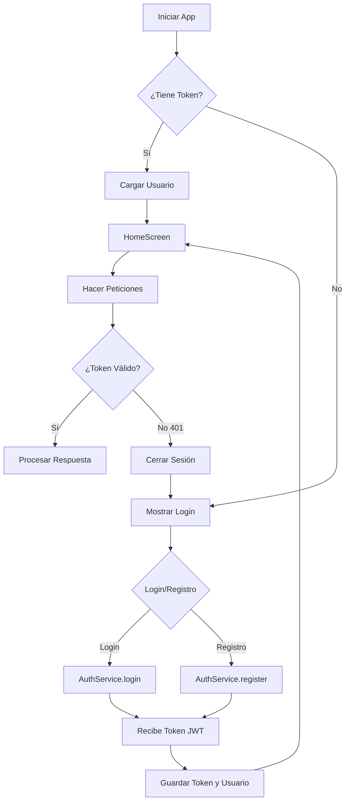

# 🔐 Implementación de Autenticación JWT en EasySave Flutter

## 📋 Resumen de Cambios

Se ha implementado la autenticación JWT (JSON Web Token) en la aplicación Flutter para consumir el backend de Spring Boot de manera segura.

## 🏗️ Arquitectura Implementada

### Servicios Creados/Modificados

1. **`auth_service.dart`** (NUEVO)
   - Maneja registro y login con JWT
   - Almacena tokens de forma segura usando `flutter_secure_storage`
   - Proporciona método `authenticatedRequest()` para hacer peticiones autenticadas

2. **`auth_manager.dart`** (ACTUALIZADO)
   - Ahora usa `flutter_secure_storage` en lugar de `shared_preferences`
   - Guarda el token JWT junto con los datos del usuario
   - Método `guardarSesion()` ahora requiere el token

3. **`usuario_service.dart`** (ACTUALIZADO)
   - Todas las peticiones ahora incluyen el header `Authorization: Bearer {token}`
   - Maneja errores 401 (No autorizado)
   - Los métodos antiguos de login/registro están marcados como `@Deprecated`

### Modelos Actualizados

4. **`usuario.dart`** (ACTUALIZADO)
   - El campo `password` ahora es opcional (`String?`)
   - Esto es necesario porque el backend JWT no devuelve la contraseña

### Pantallas Actualizadas

5. **`login_screen.dart`** (ACTUALIZADO)
   - Usa `AuthService.login()` en lugar de `UsuarioService.login()`
   - Guarda el token JWT al iniciar sesión

6. **`registro_screen.dart`** (ACTUALIZADO)
   - Usa `AuthService.register()` en lugar de `UsuarioService.crearUsuario()`
   - Guarda el token JWT al registrarse

### Configuración

7. **`app_config.dart`** (ACTUALIZADO)
   - Nueva constante `authUrl` para los endpoints de autenticación
   - Reorganización de URLs base

## 🔑 Endpoints de Autenticación

### Registro
```dart
final result = await authService.register(
  username: 'juan',
  correo: 'juan@example.com',
  password: 'password123',
  rol: 'USER',
);

if (result['success']) {
  final userData = result['data'];
  // userData contiene: token, id, username, correo, rol
}
```

### Login
```dart
final result = await authService.login(
  username: 'juan',
  password: 'password123',
);

if (result['success']) {
  final userData = result['data'];
  // userData contiene: token, id, username, correo, rol
}
```

### Peticiones Autenticadas
```dart
// Opción 1: Usar authenticatedRequest() del AuthService
final response = await authService.authenticatedRequest(
  url: 'http://localhost:8080/api/v1/usuario-service/usuarios/1',
  method: 'GET',
);

// Opción 2: Usar los métodos del UsuarioService (recomendado)
// Los métodos ya incluyen automáticamente el token
final ingresos = await usuarioService.obtenerIngresos(usuarioId);
```

## 🔒 Almacenamiento Seguro

Los siguientes datos se almacenan de forma segura usando `flutter_secure_storage`:

- `jwt_token`: Token de autenticación JWT
- `user_id`: ID del usuario
- `username`: Nombre de usuario
- `correo`: Correo electrónico
- `rol`: Rol del usuario (USER/ADMIN)
- `user_data`: Datos completos del usuario (JSON)
- `is_logged_in`: Estado de sesión

## 📱 Flujo de Autenticación



## 🛠️ Uso en Código

### Verificar Autenticación
```dart
final authService = AuthService();
final isAuth = await authService.isAuthenticated();
```

### Obtener Token Actual
```dart
final authManager = AuthManager();
final token = await authManager.obtenerToken();
```

### Cerrar Sesión
```dart
final authService = AuthService();
await authService.logout();
// O usando AuthManager
final authManager = AuthManager();
await authManager.cerrarSesion();
```

## 🔄 Migración desde el Sistema Anterior

### Antes (Sin JWT):
```dart
final usuario = await usuarioService.login(username, password);
await authManager.guardarSesion(usuario);
```

### Ahora (Con JWT):
```dart
final result = await authService.login(
  username: username, 
  password: password,
);

if (result['success']) {
  final usuario = Usuario(
    id: result['data']['id'],
    username: result['data']['username'],
    correo: result['data']['correo'],
    rol: result['data']['rol'],
  );
  await authManager.guardarSesion(usuario, result['data']['token']);
}
```

## ⚠️ Importante

1. **Todos los endpoints protegidos** del backend requieren el token JWT
2. **El token se incluye automáticamente** en todas las peticiones del `UsuarioService`
3. **Si el token expira** (401), la app debe cerrar sesión y volver al login
4. **El password no se almacena** después del login (solo el token)
5. **Para emulador Android**: Usa `http://10.0.2.2:8080` en lugar de `localhost`
6. **Para dispositivo físico**: Usa la IP de tu máquina (ej: `http://192.168.1.100:8080`)

## 🧪 Pruebas

### Probar Login
1. Ejecuta el backend de Spring Boot
2. Ejecuta la app Flutter
3. Intenta iniciar sesión con un usuario existente
4. Verifica que se reciba el token y se guarde correctamente

### Probar Registro
1. Ejecuta el backend de Spring Boot
2. Ejecuta la app Flutter
3. Crea un nuevo usuario
4. Verifica que se reciba el token y se redirija a HomeScreen

### Probar Persistencia de Sesión
1. Inicia sesión
2. Cierra completamente la app
3. Vuelve a abrir la app
4. Debería ir directamente a HomeScreen sin pedir login

### Probar Token Expirado
1. Modifica el tiempo de expiración del token en el backend a 1 minuto
2. Inicia sesión
3. Espera más de 1 minuto
4. Intenta hacer alguna acción (ej: ver ingresos)
5. Debería mostrar error de autenticación

## 📚 Referencias

- [Documentación Spring Security JWT](https://spring.io/guides/gs/rest-service-cors/)
- [flutter_secure_storage](https://pub.dev/packages/flutter_secure_storage)
- [HTTP Package](https://pub.dev/packages/http)

## 🚀 Próximos Pasos

- [ ] Implementar refresh token para renovar tokens expirados
- [ ] Agregar interceptor HTTP para renovar tokens automáticamente
- [ ] Implementar biometría para login rápido
- [ ] Agregar indicador de sesión a punto de expirar
- [ ] Implementar logout desde todas las pantallas
- [ ] Agregar pruebas unitarias para AuthService
